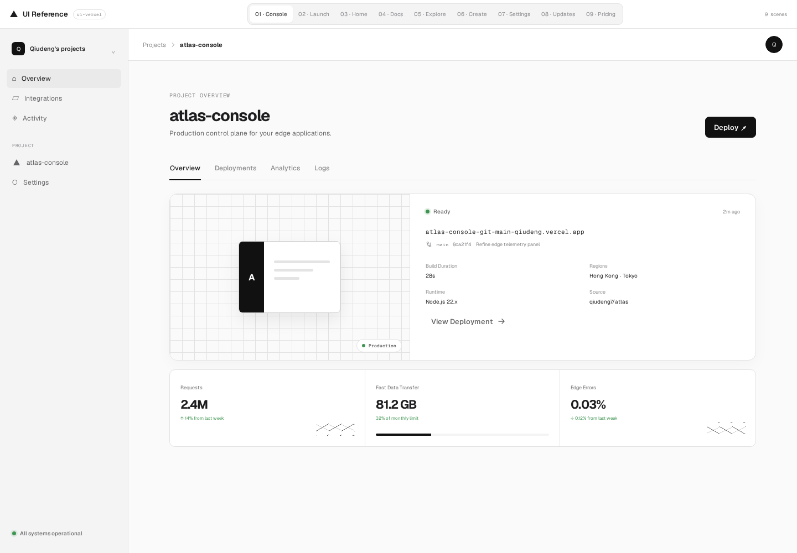
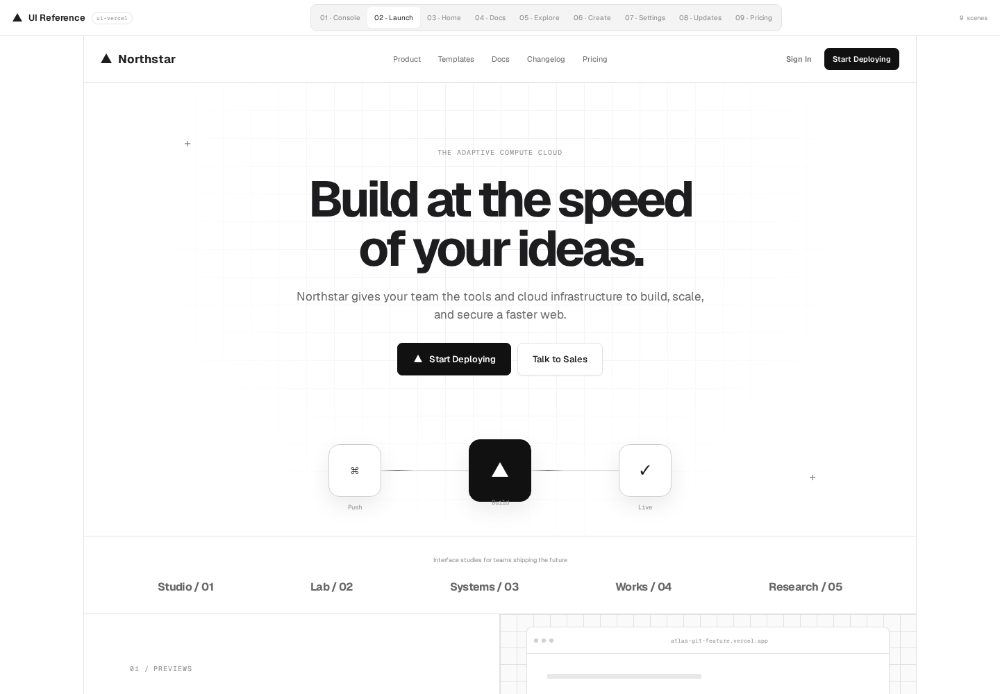
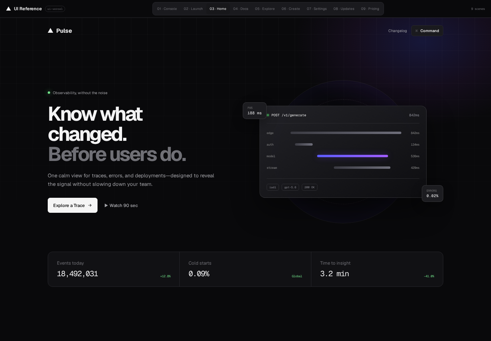
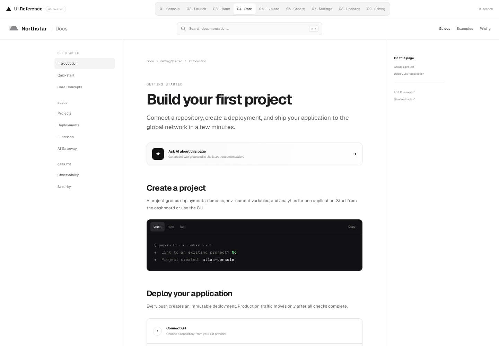
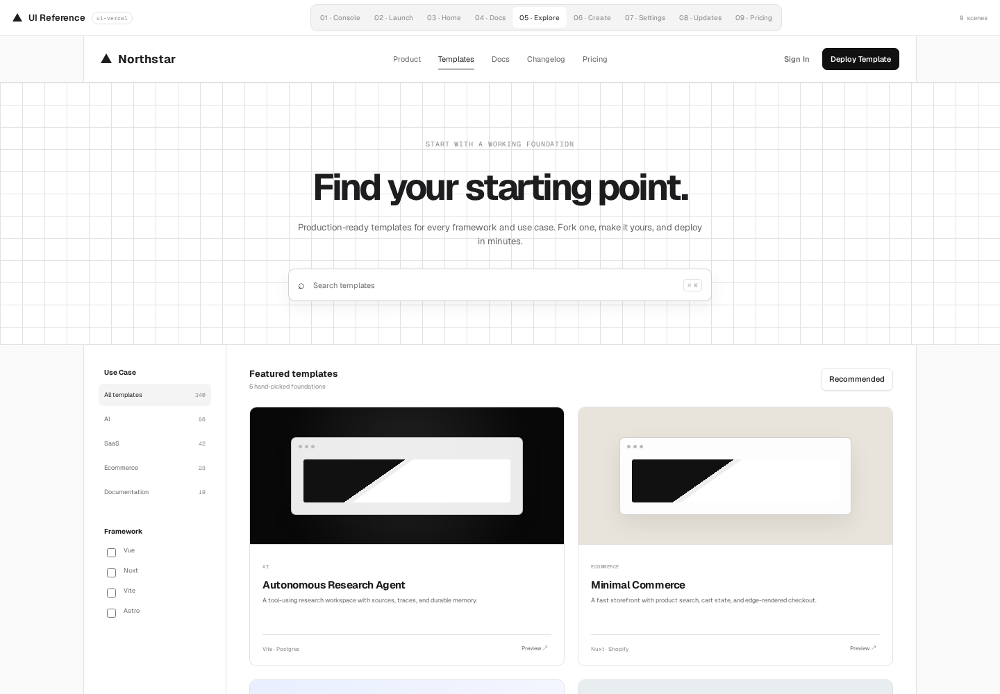
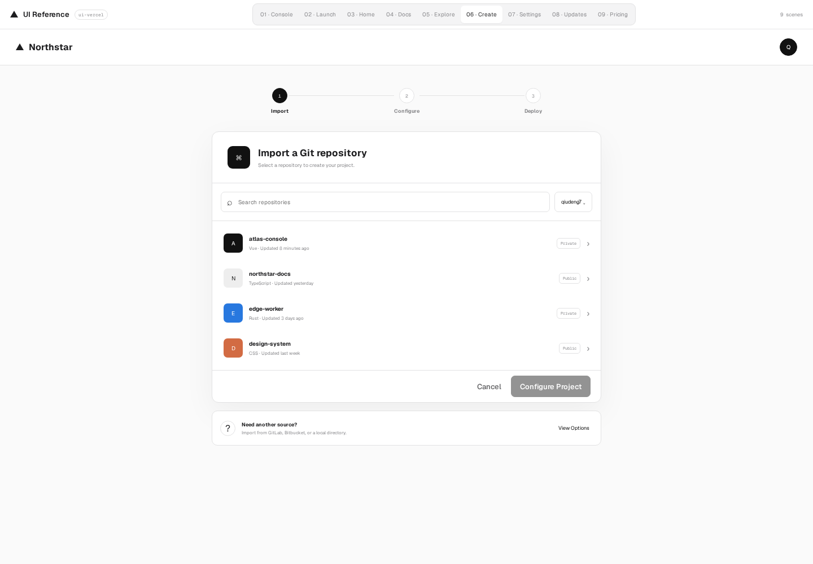
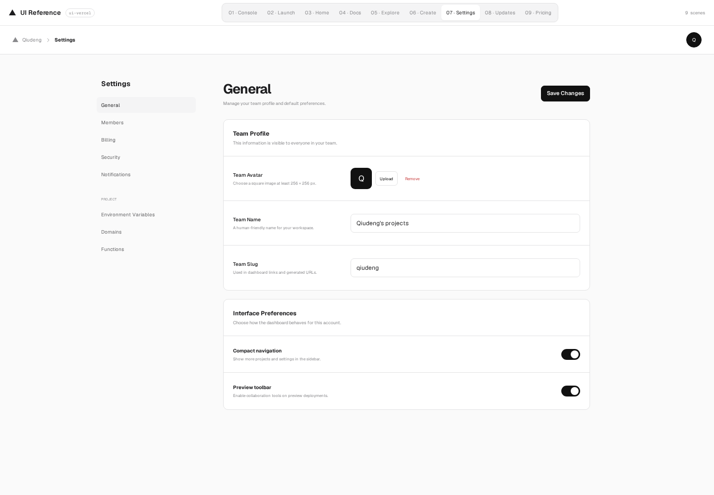
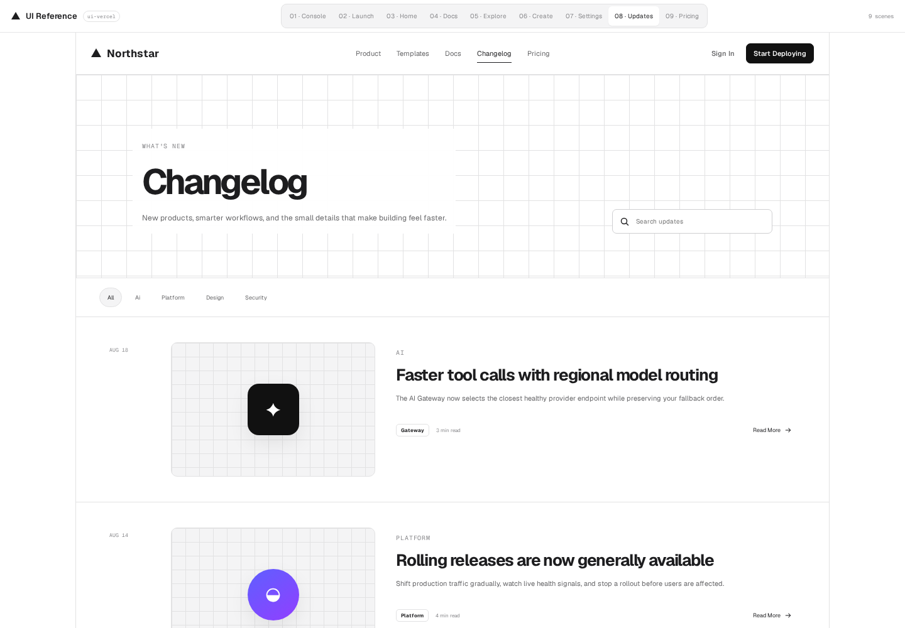
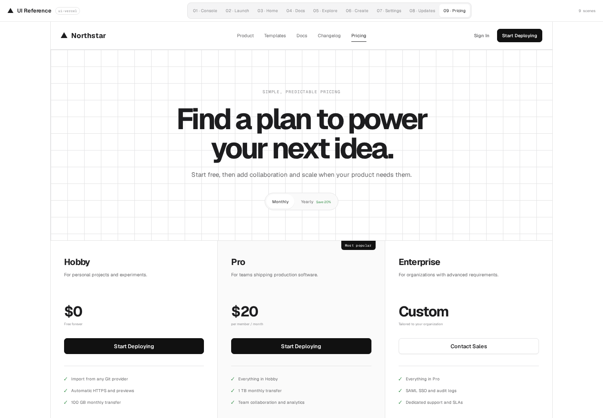

# ui-vercel

一个框架无关的产品 UI 参考项目，提炼了 Vercel 界面中克制、精确、以产品为中心的视觉与交互语言。目录包含 9 个可运行页面、可复用的 HTML/CSS 组件契约，以及供 Codex 使用的英文 Skill。

> **在线预览：** [https://vercel-ui-demo.qiudeng.workers.dev](https://vercel-ui-demo.qiudeng.workers.dev)

本项目仅用于界面设计与工程实践研究，与 Vercel 没有关联，也不包含 Vercel 的产品代码、商标或文案。`Northstar` 以及页面中的品牌、团队和数据均为虚构内容。

## 为什么 Skill 目录同时是 TypeScript 项目

这个目录有意采用 Skill 与 TypeScript 项目混合结构，同时服务三种用途：

1. **可运行的 TypeScript 参考实现**：`src/`、`tests/`、Vite 和 Wrangler 构成完整的本地预览、测试与部署链路。
2. **框架无关的组件参考**：`components/` 提供语义化 HTML、独立 CSS、设计令牌、状态约定和无障碍说明，Vue、React、服务端模板或原生 HTML 都可以移植。
3. **可安装的 Codex Skill**：根目录的 [`SKILL.md`](./SKILL.md) 是唯一 Skill 入口；更完整的英文设计说明位于 [`references/design-guide.md`](./references/design-guide.md)，仅在需要比较页面或迁移框架时读取。

## 页面截图

以下截图由目录内的 Playwright 脚本在 `1440 × 1000` 视口下从生产构建自动生成。

| 控制台 | 产品引导 | 品牌首页 |
| --- | --- | --- |
| [](public/screenshots/01-console.png) | [](public/screenshots/02-launch.png) | [](public/screenshots/03-home.png) |

| 文档 | 模板市场 | 创建向导 |
| --- | --- | --- |
| [](public/screenshots/04-docs.png) | [](public/screenshots/05-explore.png) | [](public/screenshots/06-create.png) |

| 设置 | 更新日志 | 定价 |
| --- | --- | --- |
| [](public/screenshots/07-settings.png) | [](public/screenshots/08-updates.png) | [](public/screenshots/09-pricing.png) |

## 页面场景

| 路由 | 页面模式 | 适合场景 |
| --- | --- | --- |
| `?view=console` | 产品控制台 | 总览、部署、分析与日志 |
| `?view=launch` | 产品引导页 | 解释平台能力并推动首次操作 |
| `?view=home` | 品牌首页 | 高冲击力定位与命令式探索 |
| `?view=docs` | 技术文档 | 可导航的技术内容与代码示例 |
| `?view=explore` | 模板市场 | 搜索、筛选和浏览起始模板 |
| `?view=create` | 创建向导 | 导入、配置并部署项目 |
| `?view=settings` | 设置中心 | 账户、团队、账单与安全偏好 |
| `?view=updates` | 更新日志 | 可搜索的版本动态与发布说明 |
| `?view=pricing` | 定价页面 | 套餐比较、计费周期与购买决策 |

页面顶部的 `UI Reference` 切换栏只属于评审工具，不属于虚构产品。切换页面时外壳保持挂载，仅替换当前页面内容，并妥善清理页面级监听器和动画任务。

## 本地运行

需要 Node.js 22 或更高版本，以及 pnpm。

```bash
pnpm install
pnpm dev
```

Vite 会打印本机与局域网访问地址。提交改动前建议运行：

```bash
pnpm check
pnpm test:browser
pnpm build
```

`pnpm check` 会依次执行严格 TypeScript 类型检查、单元测试和 Biome 检查；`pnpm test:browser` 会启动生产预览，并用 Playwright 验证主要交互和浏览器运行时错误。

## 复用组件

先从 [`components/tokens`](./components/tokens) 读取颜色、字号、间距等语义令牌，再从 [`components/`](./components) 选择具体组件。当前包含：

- Button
- Tabs
- Status
- Data table
- Form field
- Dialog

每个组件目录都包含一份语义化 `example.html`、一份采用 `ui-*` 命名空间的独立 CSS，以及状态和无障碍契约。它们是供开发者和 Agent 参考的源码，不会发布为 npm 包。

例如，在 Vue 中可以将 Tab 的 `aria-selected` 绑定到响应式状态，但仍应保留 `tablist`、`tab` 与 `tabpanel` 的原生语义；在服务端渲染项目中也可以输出相同结构，再添加一小段渐进增强脚本。

## 交互与性能基线

- 导航使用真实 URL，支持浏览器前进、后退和新标签页。
- Tab、筛选器、开关、Dialog 和创建步骤都会更新真实状态或内容。
- 页面级监听器、计时器和动画帧跟随页面生命周期统一释放。
- 指针视觉效果通过 `requestAnimationFrame` 合并，并尊重 `prefers-reduced-motion`。
- 避免大面积动态模糊、逐帧布局读写和仅用于装饰的全局状态。
- 原生控件、键盘焦点、表单标签、表格语义和 ARIA 状态保持完整。

参考实现使用原生 TypeScript，不要求使用 React，也不会妨碍将这些结构迁移到 Vue 或其他框架。

## 截图与部署

重新生成全部 9 张标准截图：

```bash
pnpm screenshots
```

部署静态构建到 Cloudflare Workers：

```bash
pnpm deploy
```

为保留已经公开的 Workers URL，`wrangler.jsonc` 继续使用原有 Worker 标识
`vercel-ui-demo`；Skill、包和目录名称统一为 `ui-vercel`。

## 目录结构

```text
.
├── components/           # 可移植的 HTML、CSS、令牌与交互契约
├── public/screenshots/   # 由 Playwright 生成的标准页面截图
├── references/           # 按需读取的英文扩展设计说明
├── scripts/              # 截图等项目脚本
├── src/
│   ├── components/       # 参考实现专用外壳、图标与 Toast
│   ├── core/             # 类型化路由、生命周期和 DOM 工具
│   ├── pages/            # 每个页面场景一个独立模块
│   └── styles/           # 外壳与页面样式
├── tests/                # 快速行为测试
├── SKILL.md              # 唯一的英文 Skill 入口
├── vite.config.ts        # 本地开发与生产构建
└── wrangler.jsonc        # Cloudflare Workers 静态资源配置
```

## 许可

代码以 [MIT License](./LICENSE) 开源。
